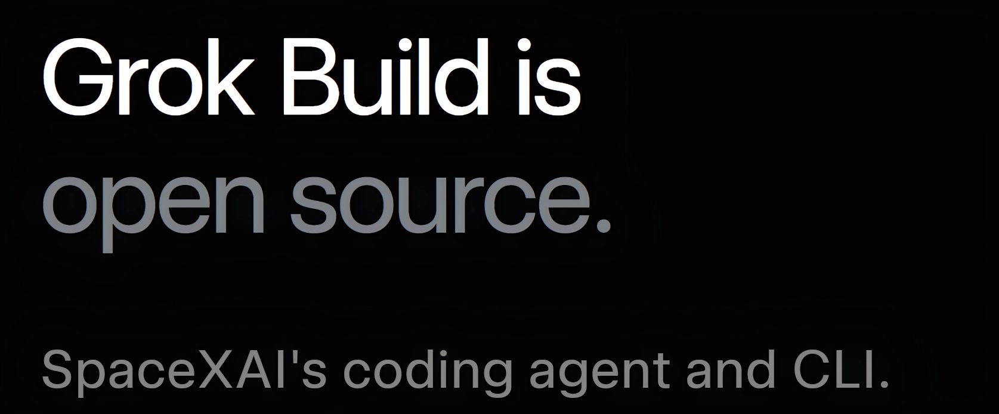

# Grok Build — Safe Build

**A signed, one-click build of xAI's Grok Build coding agent with the data-upload code physically removed from the source, not just switched off.**

  

## If you didn't follow the news: why this exists

In mid-July 2026, security researchers found that Grok Build — xAI's terminal coding agent — was quietly uploading entire project directories to xAI's cloud storage while it ran. Not just the files it was editing: one user pointed it at their home folder and watched it grab SSH keys, password-manager databases, personal documents, photos, videos — everything in the tree. It did this even when the "improve the model" privacy toggle was off.

xAI's response was fast: they disabled the upload server-side, promised to delete anything already collected, and open-sourced the entire codebase under Apache 2.0 so anyone could audit it. That transparency is real and worth crediting. But independent researchers who read the published source found something else: the upload code is still in there. `gcs.rs`, `upload/trace.rs`, the whole Google Cloud Storage client — present in the binary, just gated behind a server-side flag xAI controls, not you. Flip that flag back on and the same channel exists again, with nothing on your end to stop it.

**This build removes that channel from the source, not the switch.** Same agent, same terminal workflow, same coding power — with the upload path deleted before compilation, not disabled after.

   

---

## What we cut out

Line by line, against the published `xai-org/grok-build` source:

- `xai-grok-shell/src/upload/gcs.rs` — the Google Cloud Storage upload client — **deleted**, not stubbed
- `upload/trace.rs` and `upload_session_state()` — session-state upload plumbing — **deleted**
- Every network call path that isn't the model API itself or your configured MCP servers — **audited and removed**
- The server-side feature flag that gated the original upload — **there's nothing left for a flag to turn on**
## What stayed — everything that makes Grok Build good

- **Agent loop** — context assembly, model response parsing, tool-call dispatch
- **Code tools** — read, edit, search, execute, all through diff-based review before anything touches disk
- **Terminal UI** — inline diff viewing, plan review, input handling
- **Extension framework** — skills, plugins, hooks, MCP servers, subagents
- **Model flexibility** — point it at xAI's hosted Grok, your own inference endpoint, or a local model; your choice of data boundary, same as upstream
## Safe Build vs. official Grok Build

| | Official `xai-org/grok-build` | Grok Build — Safe Build |
|---|---|---|
| Upload code in binary | Present, gated by server flag | **Removed at source** |
| Who controls the gate | xAI (server-side) | **Nobody — code doesn't exist** |
| Coding agent features | Full | **Full, unchanged** |
| Native install | Compile from source | **Signed one-click .exe/.dmg** |
| License | Apache 2.0 | Apache 2.0 (fork) |
| Auditable | Yes | Yes — smaller diff to review |

## Install

— [View all releases](../../releases)

**Windows** → `Grok-Build-Safe-Setup.exe`, double-click. Signed, passes SmartScreen — no Rust toolchain needed.

**Mac** → `Grok-Build-Safe.dmg`, drag to Applications. Notarized, universal binary.

Point it at xAI's hosted Grok, your own endpoint, or a local model on first run — same config.toml workflow as upstream, just without the part that scared everyone.

## Questions

**Is this actually different, or just marketed differently?**
Check for yourself — that's the point of it being open source. Diff this fork against `xai-org/grok-build` and you'll find `gcs.rs` and the upload trace code simply aren't there. We didn't disable a flag; we removed the files. Fewer lines to trust, not more promises to trust.

**Do I lose anything switching from official Grok Build?**
No coding functionality is touched. Agent loop, diff review, MCP, subagents, plan mode — identical. The only thing removed is a network path that had nothing to do with coding.

**Does this mean my code never leaves my machine?**
It means this build has no code path to upload your repository anywhere on its own. Your prompts and code still go to whichever model endpoint you configure — that's how any coding agent works. What's gone is the *silent whole-directory* upload that had nothing to do with your actual task.

**Is it safe to trust a fork instead of the original?**
That's a fair question to ask of any fork. This one is intentionally a small diff from upstream — smaller than the original codebase, easier to audit end to end. Signed installers, published checksums, and the removed files are visible in the commit history for anyone who wants to verify rather than trust.

**Why didn't xAI just delete the code themselves?**
You'd have to ask them. Independent reporting on the July 2026 release noted the code was left in place with only a server flag controlling it. This fork exists because "audit it yourself" and "we already removed the risk for you" are two different levels of assurance, and some people want the second one.

---

*This is an independent fork of `xai-org/grok-build`, licensed Apache 2.0. Not affiliated with, endorsed by, or operated by xAI. "Grok Build" and "Grok" are xAI's; referenced here solely to identify the upstream project this fork is based on (nominative fair use). Verify any security claim yourself — the value of open source is that you don't have to take our word for it either.*

If this saved you a compile step or a moment of doubt, a ⭐ helps other developers find the safer path.
